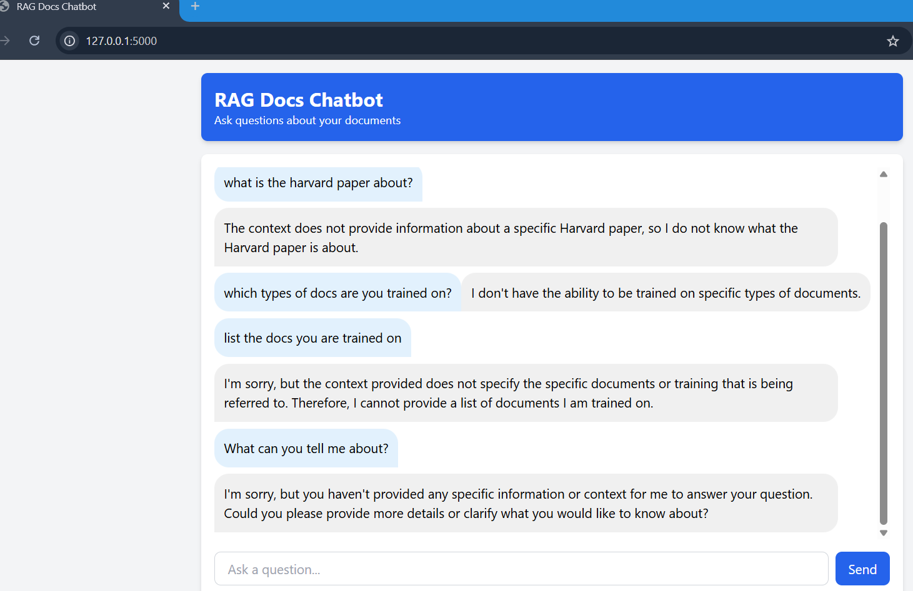
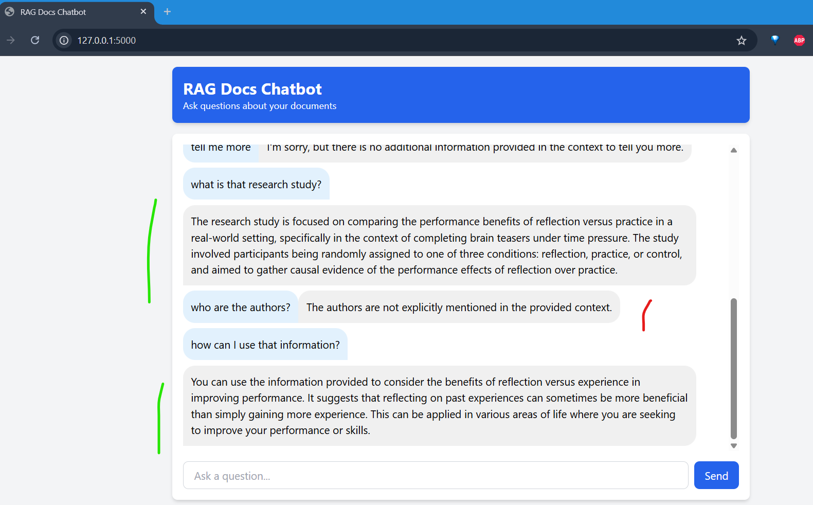
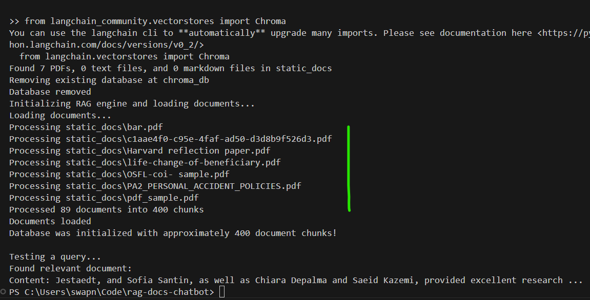

# RAG Docs Chatbot

A chatbot that uses Retrieval-Augmented Generation (RAG) to answer questions about your static documents.
Initial interface:


Some successful, some not so successful results:


The system is retrieving and correctly responding about the content of the research paper, but it's not picking up on the author information which you know is clearly stated in the document.

This likely indicates a partial success with a few possible issues:

- Chunking limitations: The document might be chunked in a way that the authors' section is in a separate chunk from the main content, and that specific chunk wasn't retrieved for this query.
- Text extraction issues: If the authors are listed in a header, footer, or special formatting in the PDF, the PyPDF2 library might not be extracting that text properly.
- Retrieval relevance: The system might not consider author information relevant enough to the query "who are the authors?" compared to content chunks.
## Features

- Document ingestion and processing (PDF, TXT, MD)
- Semantic search with embeddings
- Context-aware responses using LLM
- Simple web UI for interacting with the chatbot


## Setup and Installation

### Prerequisites

- Python 3.8+
- OpenAI API key
- todo: try with Claude Sonnet too

### Installation

1. Clone this repository:
```bash
git clone https://github.com/swapniltamse/rag-docs-chatbot.git
cd rag-docs-chatbot
```

2. Install dependencies:
```bash
pip install -r requirements.txt
```

3. Create a `.env` file in the project root and add your OpenAI API key:
```
OPENAI_API_KEY=your_openai_api_key_here
```

### Adding Documents

Add your documents to the `static_docs` directory. The system supports:

- PDF files (`.pdf`)
- Text files (`.txt`)
- Markdown files (`.md`)

### Running the Application

1. Start the application:
```bash
python app.py
```

2. Open your browser and go to `http://localhost:5000`

3. Start asking questions about your documents!

## How It Works

This chatbot uses a RAG (Retrieval-Augmented Generation) approach:

1. **Document Processing**: Documents are loaded and split into chunks
2. **Embedding Generation**: Text chunks are converted to vector embeddings using OpenAI's embedding model
3. **Retrieval**: When a query is received, the system finds the most semantically similar document chunks
4. **Generation**: The retrieved contexts are combined with the query and sent to the LLM to generate a response

## Customization

- Modify `rag_engine.py` to adjust chunk size, overlap, or retrieval parameters
- Change the LLM model by updating the `ChatOpenAI` initialization in `rag_engine.py`
- Customize the UI by editing the HTML/CSS in `templates/index.html`

## License

MIT

## Acknowledgements

This project uses the following libraries:
- [LangChain](https://github.com/langchain-ai/langchain)
- [ChromaDB](https://github.com/chroma-core/chroma)
- [OpenAI API](https://platform.openai.com/)
- [Flask](https://flask.palletsprojects.com/)
